# Flask Device API

A small Flask application that serves a home page and device information from two sources: the in-memory `dispositivos` mapping in `app.py` and the MAC-keyed records in `API.json`.

## Run locally

From the project directory, install the dependencies and start the development server:

```powershell
pip install -r req.txt
python app.py
```

The server runs in Flask debug mode at `http://127.0.0.1:5000`.

## HTTP routes

All routes currently use Flask's default `GET` method (with automatic `HEAD` and `OPTIONS` support).

| URL | Response and behavior |
| --- | --- |
| `/` | Returns a small HTML greeting and a link to `/api/saludo`. |
| `/json/<mac>` | Looks up the exact `<mac>` key in `API.json`, prints the record's name, protocols, VLANs, and status to the server console, and returns only the `Name` as plain text. For example: `/json/MAC` or `/json/AA:BB:CC:00:00:01`. An unknown key currently raises a `KeyError` and results in a server error. |
| `/api/saludo` | Returns the complete `dispositivos` mapping as JSON. |
| `/api/dispositivo/101` | Returns device 101, Router Principal, as JSON from `dispositivos`. |
| `/api/dispositivo/102` | Returns device 102, Teléfono móvil, as JSON from `dispositivos`. |
| `/api/dispositivo/103` | Returns device 103, Impresora, as JSON from `dispositivos`. |
| `/api/dispositivo/104` | Returns device 104, TV Inteligente, as JSON from `dispositivos`. |
| `/api/dispositivo/105` | Returns device 105, Computadora, as JSON from `dispositivos`. |
| `/api/dispositivo/106` | Returns the hard-coded Cámara de seguridad record as JSON. |
| `/api/dispositivo/107` | Returns the hard-coded Consola de videojuegos record as JSON. |
| `/api/dispositivo/108` | Returns the hard-coded Laptop de trabajo record as JSON. |
| `/api/dispositivo/109` | Returns the hard-coded Termostato inteligente record as JSON. |
| `/api/dispositivo/110` | Returns the hard-coded Altavoz inteligente record as JSON. |

`diccionarios()` is a helper function in `app.py`, but it has no route decorator and therefore is not an HTTP endpoint.

## Route map

```mermaid
flowchart TD
    Client[HTTP client]
    Client --> Home["GET /"]
    Client --> MacLookup["GET /json/&lt;mac&gt;"]
    Client --> AllDevices["GET /api/saludo"]
    Client --> DeviceGroup["GET /api/dispositivo/&lt;id&gt;"]

    Home --> HomeHTML["HTML greeting and API link"]
    MacLookup --> MacRecord["API.json: print record fields; return Name text"]
    AllDevices --> DeviceMap["JSON: devices 101-105"]
    DeviceGroup --> Device101["101: Router Principal (JSON)"]
    DeviceGroup --> Device102["102: Teléfono móvil (JSON)"]
    DeviceGroup --> Device103["103: Impresora (JSON)"]
    DeviceGroup --> Device104["104: TV Inteligente (JSON)"]
    DeviceGroup --> Device105["105: Computadora (JSON)"]
    DeviceGroup --> Device106["106: Cámara de seguridad (JSON)"]
    DeviceGroup --> Device107["107: Consola de videojuegos (JSON)"]
    DeviceGroup --> Device108["108: Laptop de trabajo (JSON)"]
    DeviceGroup --> Device109["109: Termostato inteligente (JSON)"]
    DeviceGroup --> Device110["110: Altavoz inteligente (JSON)"]
```



## Branch snapshot

At the time this reference was written, the checked-out local branch is `feature/FlaskV01`. The GitHub repository's target branch is `feature`:

- Repository: <https://github.com/DiegoReyPikzo/Flask>
- Remote branch: `feature`

## Current limitations

- Devices 106-110 are hard-coded examples rather than records in the shared device mapping.
- The `/json/<mac>` lookup expects an exact key from `API.json`; missing keys are not converted into a JSON 404 response.
- Device routes are individually declared in `app.py`; there is no dynamic route for arbitrary device IDs.
- The app starts with `debug=True`, which is intended for local development.